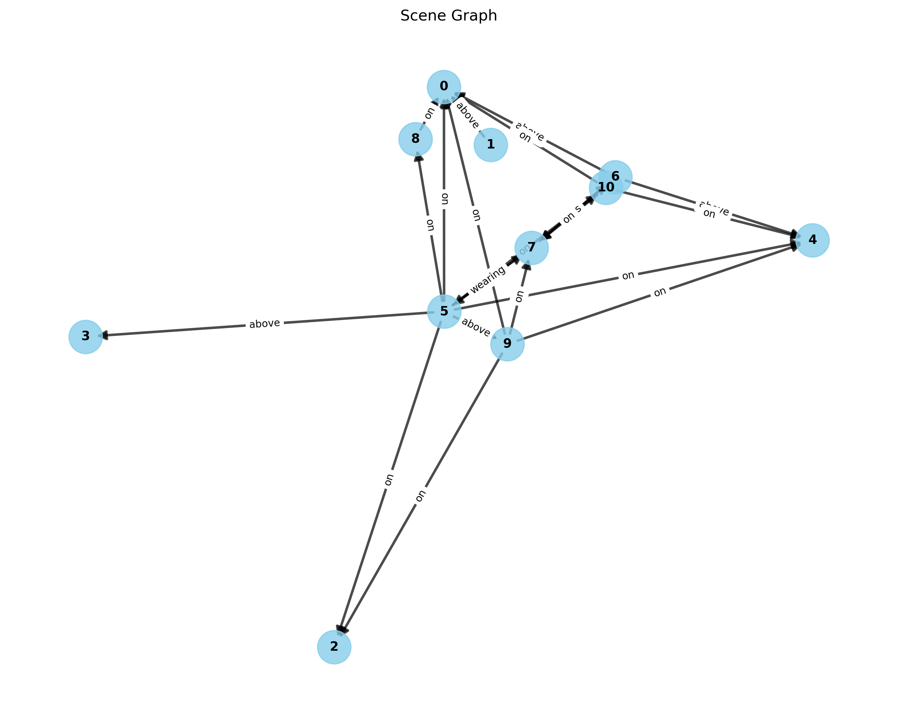
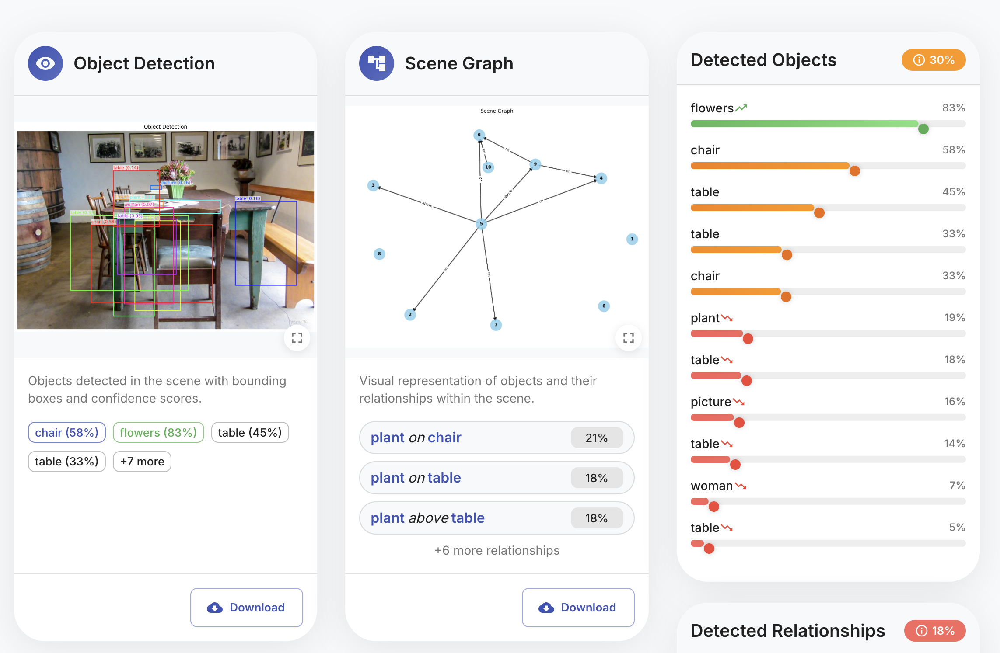

# Scene Graph Generation



A full-stack application for generating scene graphs from images. This
application utilizes deep learning to detect objects in images and identify
relationships between them, creating a structured graph representation.

## Features

- **Object Detection**: Identifies objects in images using YOLOv8
- **Relationship Prediction**: Determines relationships between detected objects
- **Graph Visualization**: Generates visual graph representations of scenes
- **Interactive UI**: Modern React-based interface for uploading and viewing
  results
- **REST API**: FastAPI backend for processing images and serving results

## Project Structure

The project is organized into two main components:

- **Backend**: Python-based FastAPI application that handles image processing
  and model inference
- **Frontend**: React application that provides an intuitive user interface

## Technologies Used

### Backend

- Python 3.8+
- FastAPI
- PyTorch
- YOLOv8
- NetworkX for graph visualization
- Matplotlib for image annotation

### Frontend

- React
- Material-UI
- Framer Motion for animations
- Axios for API communication

## Getting Started

See the [Backend README](backend/README.md) and
[Frontend README](frontend/README.md) for detailed setup instructions.

### Quick Start

1. Clone the repository:

   ```bash
   git clone https://github.com/dixisouls/scene-graph-generation.git
   cd scene-graph-generation
   ```

2. Set up the backend:

   ```bash
   cd backend
   python -m venv venv
   source venv/bin/activate  # On Windows: venv\Scripts\activate
   pip install -r requirements.txt
   # Download the model.pth file (see Backend README)
   python start.py
   ```

3. Set up the frontend:

   ```bash
   cd ../frontend
   npm install
   npm start
   ```

4. Open your browser and navigate to http://localhost:3000

## Sample Results

The application processes images to produce two primary visualizations:

1. **Annotated Image**: The original image with bounding boxes around detected
   objects
2. **Scene Graph**: A graph representation showing objects as nodes and
   relationships as edges



## Future Improvements

- Add user authentication
- Implement batch processing for multiple images
- Improve relationship prediction accuracy
- Add custom object detection training
- Support for video scene graph generation

## Contributing

Contributions are welcome! Feel free to submit a Pull Request.

## License

This project is licensed under the MIT License - see the LICENSE file for
details.

## Acknowledgments

- YOLOv8 for object detection
- PyTorch for deep learning framework
- Material-UI for React components
